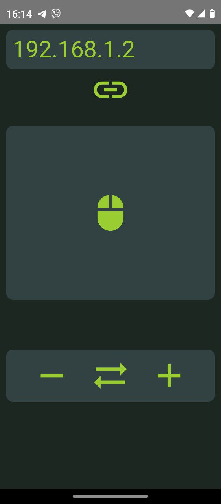

# Lazy Mouse  
## Why  
Just for fun.  
I learned about Dioxus and decided to try to create something with it. For example, I could lie on the couch and move my finger across the phone screen to control the mouse cursor. 
I'm just lazy, so the mouse is lazy too :)

## Giving up pride :)
Everything is done quick-and-dirty since the goal was not optimization and I don't know what else. 
I just wanted to know how easy it is to implement on Dioxus, at least compared to Flutter.
I'll tell you right away to set up a working environment for Dioxus so that you can compile for Android on Windows - it's easier to drown yourself in the nearest ditch :)
There was a special sadness with the damned OpenSSL and if I hadn't finally found this [link](https://users.rust-lang.org/t/how-do-you-fix-cargo-leptos-installation-errors-because-of-openssl-sys/129752)  
which led me to a very simple solution, then I would probably give up everything until better times.

On Flutter it's all kind of out of the box.

## Very short description  
### Server
Very simple synchronous WebSocket server with use of tungstenite 
### Client
Android app (Dioxus 0.7.0-alfa.3)  
 

Controls (Top to bottom)  
1) Ip Addess of my computer  
2) "Touchpad"  
3) "Mouse Wheel"

